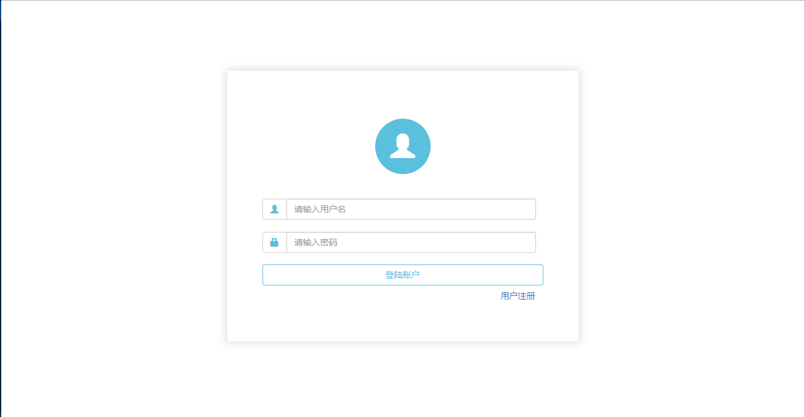
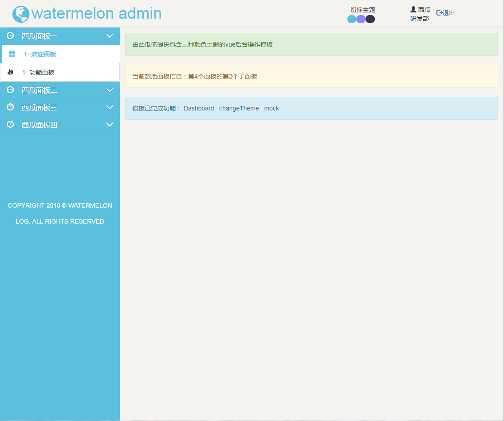

# vue-admin

基于axios，bootstrap，vue-router，webpack和express等等的基础vue后台控制模板，默认有三个颜色主题可切换。

# 项目优势

- login页和register页共用一个组件页，做了相关的输入数据验证，并写了相关提示。
- 默认提供login登陆状态管理。
- 注册完成之后直接登陆，不用再跳转到登录页去登陆。
- 比较简洁的页面设计。
- 颜色主题三色可选(blue,pue,dark)，默认主题是blue。
- 按照尽可能分离的逻辑，对于各组件之间进行进行了解耦设计。
- 路由跳转实时在网址上记录当前激活的面板情况。
- 对于项目模板做了响应式设计，保证在不同屏幕状态下的良好阅读体验。
- 精简的依赖包，删除了测试相关依赖包。
- 精简的指令，删除了测试相关指令。
- 降低了对于网络环境不太好的情况，资源请求压力。
- 左侧面板数据支持灵活配置，数据修改路径是项目根文件下`static/mock/leftPanelData.json`。
- 因为集成了axios，更方便请求其他接口数据。

# 运行项目

``` bash
# install dependencies

  # Good network environment
    # install dependencies by cnpm or npm
    cnpm i

  # Bad network environment
    # global install yarn
    cnpm i yarn -g

    # install dependencies by yarn
    yarn install

# serve with hot reload at localhost:8080
npm run dev

# build for production with minification
npm run build

```

# 项目效果图







# 修改主题效果

放上现有颜色配置

```scss
@charset "utf-8";

//文件路径  当前项目根文件下  src/assets/css/thems.scss

$linear-start:#1861D5;//高亮效果的渐变开始颜色
$linear-end:#3080FE;//高亮效果的渐变结束颜色

$theme_blue_color: #5bc0de; // 页面蓝色主题 --默认色
$theme_blue_normal_color:#323a45; // 页面蓝色主题 --未激活色
$theme_blue_active_color: #31708f; // 页面蓝色主题 --默激活色

$theme_pure_color:#8f88f9; //页面紫色主题 --默认色
$theme_pure_normal_color:#4772d9; //页面紫色主题 --未激活色
$theme_pure_active_color:#b1c3ef; //页面紫色主题 --默激活色

$theme_dark_color:#323a45; //页面灰色主题 --默认色
$theme_dark_normal_color:rgb(123, 123, 123); //页面灰色主题 --未激活色
$theme_dark_active_color:#83878a; //页面灰色主题色
```
